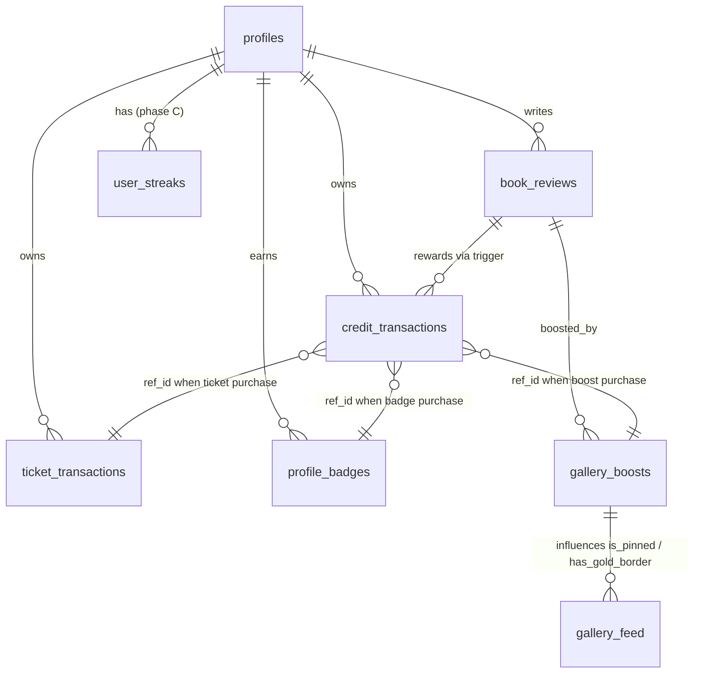

# 🥜 PEANUTS ECONOMY — SHOP & POWERS MASTER PLAN

> **Status:** Planning document — no code changes yet.
> **Last updated:** 2026-04-21
> **Owner:** Little Chubby Press
> **Scope:** Redesign the Peanuts shop, add real power value for users, close all "dead-money" loops, and make the whole system **actionable, visible, and professional** — without breaking the existing app.

---

## TABLE OF CONTENTS

1. [Executive Summary](#1-executive-summary)
2. [Current State Audit](#2-current-state-audit)
3. [Loose Cables in the App (Critical Findings)](#3-loose-cables-in-the-app-critical-findings)
4. [Design Principles](#4-design-principles)
5. [Shop Catalog — Current + Proposed](#5-shop-catalog--current--proposed)
6. [Powers & Where They Render (UI Matrix)](#6-powers--where-they-render-ui-matrix)
7. [Gamification Layer](#7-gamification-layer)
8. [Transaction History Redesign](#8-transaction-history-redesign)
9. [Database Migrations Needed](#9-database-migrations-needed)
10. [API Endpoints Needed](#10-api-endpoints-needed)
11. [Phased Implementation Roadmap](#11-phased-implementation-roadmap)
12. [Brand & Voice Rules for the Shop](#12-brand--voice-rules-for-the-shop)
13. [Risk Log & Mitigations](#13-risk-log--mitigations)
14. [Open Decisions (User Input Needed)](#14-open-decisions-user-input-needed)

---

## 1. EXECUTIVE SUMMARY

### The Problem

Our Peanuts economy is **financially complete but visually invisible**. Users can earn, spend, and see balances — but the *powers* they purchase are largely dead weight because the app does not render them to other users, which defeats the whole loop:

```
  earn 🥜  →  spend on cool stuff  →  show off / get benefit  →  motivation to earn more
                                       ↑
                                    BROKEN HERE
```

Concrete symptoms:
- A user spends **15 peanuts** on a "Star Parent" badge → nothing visible happens anywhere.
- A user spends **10 peanuts** to pin or gold-border their review → the backend records it, the view computes `is_pinned=true`, but the gallery CSS never uses that flag.
- The transaction history becomes unreadable after a few months (linear list, no summary).
- The main nav is a dead-end for kids/parents wanting to *use* what they bought.

### The Goal

Build a **three-layer value stack** that gives each peanut a clear purpose:

| Layer | What | User sees it in... |
|-------|------|--------------------|
| **Cosmetic** | Badges, frames, borders | Profile, Gallery, Reviews |
| **Functional** | Premium downloads, extra tickets, gifts | Coloring Corner, Lottery, Friends |
| **Social** | Featured placement, shoutouts, streaks | Home page, Gallery rotations |

### The Outcome

A shop that looks **professional**, feels **rewarding**, and gives the brand a **retention engine** — without breaking what currently works.

---

## 2. CURRENT STATE AUDIT

### 2.1 What works ✅

- **Credit ledger**: `credit_transactions` table, RLS-protected, atomic inserts, idempotent review rewards via trigger.
- **Ticket ledger**: `ticket_transactions` + `buy_tickets()` / `enter_giveaway()` RPCs with advisory locks → safe from race conditions.
- **Atomic purchases**: `purchase_badge()`, `purchase_boost()`, `purchase_download()` all check balance + deduct + grant in one transaction.
- **Header balance display**: Peanuts + tickets pills are live, clickable, responsive.
- **Profile hero**: "Available currencies" shows both balances clearly.
- **Rate limits**: Share rewards (3/day), badge/boost (5/hour), downloads (20/hour), tickets (10/hour).
- **Transaction history API**: Paginated, filterable (`all|earned|spent`), returns totals.

### 2.2 What is bought but invisible ❌

| Power | DB | API | UI rendering |
|-------|----|----|---------------|
| Frame Gold / Silver badges | ✅ | ✅ | **❌ Never shown** |
| Top Reviewer badge | ✅ | ✅ | **❌ Never shown** |
| Star Parent badge | ✅ | ✅ | **❌ Never shown** |
| Pin 7d on review | ✅ | ✅ | `is_pinned` computed in view, never read by gallery.astro |
| Gold border on review | ✅ | ✅ | `has_gold_border` computed in view, never styled in CSS |

### 2.3 What earns currency today

| Source | Reward | Mechanism |
|--------|--------|-----------|
| Approved review (qualifying) | **+5 🎟️ tickets** (no peanuts) | DB trigger on `book_reviews.status → 'approved'` — **only if** the review contains a book cover image AND ≥1 colored interior photo |
| Approved review (no photos / insufficient) | 0 | Published but earns nothing — user is invited to re-submit with photos |
| Share link | +1 🥜 (max 3/day) | `POST /api/share-reward` |
| Admin grant | +N 🥜 or +N 🎟️ | Infra ready, **no UI yet** |

> 🔑 **How review rewards work (existing rule, documented for clarity):**
> - Book reviews reward **tickets, not peanuts**. Peanuts stay as the "casual earning" currency (shares + streaks + milestones); tickets are the "proof-of-engagement" currency earned by showing real interaction with our books.
> - **Amazon reviews are explicitly forbidden from rewards** (Amazon TOS prohibits incentivized reviews). Only on-site reviews posted via our review form can earn tickets.
>
> **Qualifying on-site review requires:**
> 1. At least **1 photo of the book cover** (to confirm ownership of our book).
> 2. At least **1 photo of a colored interior page** (proof the child actually used the book).
>
> Reviews without both photos are still publishable (optional) but earn 0 tickets. Admin moderation checks both before approving. This naturally filters spam and gives us authentic gallery content.

### 2.4 What spends peanuts today

| Use | Cost | Target |
|-----|------|--------|
| Download artwork | 1–3 🥜 | Coloring Corner premium items |
| Badge | 15 🥜 | Profile decoration (invisible today) |
| Review boost | 10 🥜 | Pin or gold-border (invisible today) |
| Lottery tickets | 3 🥜 each | Monthly book giveaway |

---

## 3. LOOSE CABLES IN THE APP (CRITICAL FINDINGS)

These are issues that must be fixed regardless of what we expand into. **They cost users real peanuts without delivering value.**

### 🔴 L1 — Gold border & pin boost never display in gallery
- **Where:** `src/pages/[lang]/gallery.astro` reads `is_pinned` and `has_gold_border` from the API but the template ignores them.
- **Impact:** 10 🥜 spent → zero visible change.
- **Fix:** Add CSS classes `.gallery-card.is-pinned` (📌 ribbon + first in sort) and `.gallery-card.has-gold-border` (shining border). Mark them with the API flags.

### 🔴 L2 — Profile badges never render anywhere
- **Where:** `profile_badges` table complete, RLS allows public read, but NO component displays them.
- **Impact:** 15 🥜 spent → zero visible change on any page.
- **Fix:** Render badge strip on:
  - `/profile` (hero, next to display name)
  - Gallery card avatars
  - Review author line on book pages

### 🟡 L3 — Boost renewal blocked
- **Where:** `purchase_boost()` rejects re-purchase of same boost type while active.
- **Impact:** User wants to extend a pin → error "boost_active".
- **Fix:** Allow additive extension: if same type active, add 7 days to existing `expires_at` instead of rejecting. Communicate as "Extend" button in UI.

### 🟡 L4 — Orphan `reason='giveaway'` in credit_transactions
- **Where:** CHECK constraint allows it, i18n has a label for it, but no endpoint writes it.
- **Impact:** Legacy noise; can be repurposed as "giveaway bonus" when we add winning rewards (phase 3).

### 🟡 L5 — Admin grant/deduct UI missing
- **Where:** DB + RLS ready, no admin panel form.
- **Impact:** Support cases need direct SQL. Not user-facing but slows ops.
- **Fix:** Simple admin page `/admin/users/:id/grant` with amount + reason note (Phase B of roadmap).

### 🟢 L6 — Transaction history UX
- **Where:** `/peanuts/` shows unbounded linear list.
- **Impact:** Unusable after 3+ months of activity.
- **Fix:** Summary cards + group-by-day + 30-day default + "Export CSV" for power users. See section 8.

### 🟢 L7 — `/peanuts/` balance occasionally showed 0
- **Status:** Fixed in commit `3803481` with fallback sum. Keep the fallback permanent.

---

## 4. DESIGN PRINCIPLES

Every shop decision must pass these five gates:

1. **Visible value** — if the user spends it, SOMEONE (the user or others) must see it within 5 seconds.
2. **Mobile-first** — 80%+ of users are on mobile; no shop layout may break horizontal space or require pinch-zoom.
3. **Kid-safe** — no dark patterns, no chance-of-loss framing ("don't miss out!" is OK; "you'll lose!" is not).
4. **Bilingual parity** — every label ships with `es` + `en` in `src/data/i18n.ts`.
5. **Reversible** — no hard-deletes from user. If they buy something regrettable, admin can compensate.

---

## 5. SHOP CATALOG — CURRENT + PROPOSED

Cost philosophy:
- **Small (1–3🥜)** = frequent, consumable (downloads, 1 ticket)
- **Medium (10–15🥜)** = weekly decision (boosts, most badges)
- **Big (20–50🥜)** = monthly splurge / collectible (early access, limited badges, gift packs)

### 5.1 Current items (keep & enable)

| Item | Cost | Duration | Status |
|------|------|----------|--------|
| 🎨 Premium coloring download | 1–3 🥜 | permanent | ✅ works |
| 📌 Pin review (7d) | 10 🥜 | 7 days | 🔴 fix L1 |
| ✨ Gold border (7d) | 10 🥜 | 7 days | 🔴 fix L1 |
| 🖼️ Frame Gold (avatar) | 15 🥜 | permanent | 🔴 fix L2 |
| 🪞 Frame Silver (avatar) | 15 🥜 | permanent | 🔴 fix L2 |
| ⭐ Top Reviewer badge | 15 🥜 | permanent | 🔴 fix L2 |
| 💖 Star Parent badge | 15 🥜 | permanent | 🔴 fix L2 |
| 🎟️ Giveaway ticket | 3 🥜 | next draw | ✅ works |

### 5.2 Proposed additions — Tier 1 (functional powers)

| Item | Cost | Duration | What it does | Where it shows |
|------|------|----------|--------------|----------------|
| 🎁 Gift a ticket (to friend) | 5 🥜 | instant | Send 1 giveaway ticket to another user by email/username | Recipient gets notification + it appears in their ticket balance |
| 📚 Wishlist unlimited (if we add limits) | 10 🥜 | permanent | Unlock 50+ book wishlist slots | Books page `+` button |
| 🎨 Coloring multi-pack | 5 🥜 | permanent | Bundle discount: 3 downloads for 5 (instead of 3×1-3) | Coloring Corner |
| 🔔 Early access to new book | 20 🥜 | permanent (per book) | See cover + first page 7 days before launch | Books page "Early access" ribbon |
| 🌟 Gallery highlight | 8 🥜 | 7 days | Your photo rotates in home page hero | Home page |

### 5.3 Proposed additions — Tier 2 (cosmetic / collectible)

| Item | Cost | Duration | What it does | Where it shows |
|------|------|----------|--------------|----------------|
| 🎭 Animated avatar frame | 20 🥜 | permanent | Subtle CSS animation on avatar border | Anywhere avatar shows |
| 🏆 Season badge (spring, summer…) | 12 🥜 | limited window | Only available during 2–3 months, then gone | Badges row |
| 🎄 Holiday badge (christmas, halloween) | 25 🥜 | 1 month window | Higher-tier limited badge | Badges row |
| 💬 Custom profile color | 8 🥜 | permanent | Pick hero accent color from 6 brand-safe options | Profile page |
| 🎖️ Milestone auto-badges | FREE | unlocked | Auto-granted at 50/100/250/500 lifetime peanuts earned | Profile badges row |

### 5.4 Proposed additions — Tier 3 (social / viral)

| Item | Cost | Duration | What it does | Where it shows |
|------|------|----------|--------------|----------------|
| 📣 Shoutout on social | 30 🥜 | one-time | Brand shares your gallery photo on Instagram/Bluesky | External |
| 🎯 Pin to home page | 25 🥜 | 3 days | Your review pinned to home page "community loves" strip | Home page |
| 💌 Personalized postcard (physical) | 50 🥜 | one-time | Real postcard mailed to address on file | Physical |

> ⚠️ Tier 3 items require operational process. **Do not launch until Phase D.**

---

## 6. POWERS & WHERE THEY RENDER (UI MATRIX)

This is the single source of truth for **what shows where**. Anything not listed here is an invisible purchase → not allowed.

### 6.1 Profile page (`/profile`)

```
┌─────────────────────────────────────────────┐
│  [Avatar+frame]   Ivan ⭐💖📌             │ ← badges strip
│                   ivan@...                  │
│                   🗓️ Member since...        │
│                                             │
│   AVAILABLE CURRENCIES                      │
│   🥜 6 Peanuts    🎟️ 5 Tickets           │
│                                             │
│   [ Peanuts Shop & history ]                │
└─────────────────────────────────────────────┘
```

Rendering rules:
- Badges appear as small emoji chips, max 6 visible, +N more on click.
- Avatar frame (`frame_gold`, `frame_silver`) applied as CSS ring around avatar.
- Milestone badges show first (bigger), then purchased badges.

### 6.2 Gallery card

```
┌─────────────────────────┐
│ [photo]       📌 Pinned │  ← if is_pinned
├─────────────────────────┤
│ ⭐ by Ivan ⭐💖          │  ← author + badges (max 3)
│ "The book was so fun!"  │
└─────────────────────────┘
  ↑ gold border if has_gold_border
```

Rendering rules:
- `.gallery-card.is-pinned` → show 📌 ribbon top-right, sort first (already sorted in DB).
- `.gallery-card.has-gold-border` → 2px gold animated border.
- Only first 3 active badges render to avoid clutter.

### 6.3 Review on book page

- Pinned reviews go first inside the reviews list (before normal chronological).
- Gold-border review gets the same 2px border style.
- Author name shows up to 2 badges inline.

### 6.4 Home page (Phase C+)

- New section: "✨ Community spotlight" — cycles gallery highlights bought via 🌟 Gallery highlight (5.2).
- If empty (no active highlights), fallback to algorithmic top-rated review of the week.

### 6.5 Coloring corner

- "Premium" artworks show 🥜 price badge on thumbnail.
- Gift-a-ticket option surfaced in user dropdown (Phase B).

---

## 7. GAMIFICATION LAYER

Loyalty engine that makes earning feel rewarding without gambling mechanics.

### 7.1 Daily streak (gentle, no FOMO)
- Visit the site on consecutive days → +1 🥜 on day 3, +2 🥜 on day 7, resets to zero on miss.
- Max 10 🥜/week to prevent abuse.
- Table: `user_streaks (user_id, last_visit_date, current_streak, longest_streak)`.
- Shown as tiny flame emoji on profile: 🔥 7-day streak.

### 7.2 Milestone auto-badges (free loyalty rewards)
| Threshold (lifetime earned) | Badge | Label |
|---|---|---|
| 50 🥜 | 🌱 | Sprout |
| 100 🥜 | 🌿 | Rising reader |
| 250 🥜 | 🌳 | Community pillar |
| 500 🥜 | 🏆 | Legend |
| 1000 🥜 | 👑 | Royal reader |

Auto-granted by DB trigger when `credit_transactions` positive-sum crosses threshold.

### 7.3 Monthly top earners
- Top 5 users by peanuts earned in the current month → leaderboard on `/peanuts/` (opt-in visible name).
- Prize: +10 🥜 bonus + temporary "Top Earner of April" badge for next month.

### 7.4 Limited-time drops (scarcity, not FOMO)
- Every 2 weeks, 1 new badge available for 48 hours at slight premium (20–25 🥜).
- Communicates via newsletter + banner.
- Never uses loss framing ("don't miss it!"); uses positive framing ("new badge this weekend 🎉").

---

## 8. TRANSACTION HISTORY REDESIGN

Replace the endless list with a **three-section view** that scales for years of activity.

### 8.1 Section A — Summary card (always visible)

```
┌────────────────────────────────────────────┐
│ 📊 Last 30 days                            │
│ ──────────────────                          │
│ 🔗 Shares        +12  (12 events)          │
│ 📝 Reviews       +10  (2 reviews)          │
│ 🎨 Downloads      −8  (4 artworks)         │
│ 🎟️ Tickets       −6  (2 purchases)        │
│ ─────────────────                           │
│ NET   +8 🥜                                 │
│                                             │
│ [This month ▾] [Last 90 days] [All time]   │
└────────────────────────────────────────────┘
```

- Buckets by `reason`, computes count + sum.
- API: new endpoint `GET /api/credit-summary?range=30d` (or extend `credit-history`).

### 8.2 Section B — Grouped day list (collapsible)

```
▸ Apr 21, 2026          Net +1 🥜  (1 event)
▸ Apr 20, 2026          Net +2 🥜  (3 events)
▾ Apr 19, 2026          Net −2 🥜  (4 events)
    🔗 Shared link      +1 🥜  "Zebra goes to town"
    🔗 Shared link      +1 🥜  "Tiger's nap"
    🔗 Shared link      +1 🥜  "Puppy party"
    🎟️ Bought tickets  −5 🥜  → 1 ticket
```

- Default: all days collapsed.
- Click to expand.
- Each transaction shows context (title, link) where available.

### 8.3 Section C — Pagination + export

- "Load older" button fetches next 30-day window (no infinite scroll).
- "Export CSV" link at the bottom for full history (for power users / accounting).
- Default range: **last 30 days** (not "all time").

### 8.4 Mobile rules
- Summary card full width.
- Grouped rows stack icon-left, amount-right.
- "Load older" large tap target.

---

## 9. DATABASE MIGRATIONS NEEDED

Each in its own numbered migration file:

### 9.1 `032_boost_extension.sql`
- Modify `purchase_boost()` to add 7 days to existing `expires_at` if active same-type boost exists, instead of rejecting.

### 9.2 `033_user_streaks.sql`
- New table `user_streaks (user_id pk, last_visit_date, current_streak int, longest_streak int)`.
- RLS: users read own, service role writes.
- RPC `touch_streak(p_user_id)` called on page view / login.

### 9.3 `034_milestone_badges.sql`
- New badge types in `profile_badges.badge_type` check: `milestone_50`, `milestone_100`, `milestone_250`, `milestone_500`, `milestone_1000`.
- Trigger on `credit_transactions` insert: if positive sum crossed threshold, insert corresponding badge (idempotent).

### 9.4 `035_gift_tickets.sql`
- New RPC `gift_ticket(p_sender_id, p_recipient_email, p_cost=5)` — deducts peanuts from sender, adds ticket to recipient, emits notification.

### 9.5 `036_profile_customization.sql`
- Add `profiles.accent_color text` + `profiles.animated_frame boolean default false`.
- Expand `badge_type` check with `frame_animated`.

### 9.6 `037_monthly_top_earners.sql`
- Materialized view `v_monthly_top_earners` refreshed nightly.
- RPC `award_monthly_top_earners(p_month)` runs 1st of month via scheduled job.

### 9.7 `038_notification_prefs.sql` (supports Phase E)
- Add `profiles.notification_prefs jsonb`.

### 9.8 Cleanup
- Remove orphan `reason='giveaway'` from CHECK constraints **only after** milestone trigger uses something else; or repurpose as "giveaway_win" bonus when winner is selected.

---

## 10. API ENDPOINTS NEEDED

### 10.1 New

| Endpoint | Method | Auth | Purpose |
|----------|--------|------|---------|
| `/api/gift-ticket` | POST | cookie | Call `gift_ticket()` RPC |
| `/api/credit-summary` | GET | cookie | Bucketed sums by reason for range |
| `/api/credit-history.csv` | GET | cookie | Stream full history as CSV |
| `/api/touch-streak` | POST | cookie | Called by layout on pageview |
| `/api/admin/grant-peanuts` | POST | admin | Amount + reason + target user |
| `/api/admin/grant-tickets` | POST | admin | Amount + reason + target user |
| `/api/buy-highlight` | POST | cookie | Purchase 7d gallery highlight |
| `/api/buy-early-access` | POST | cookie | Per-book early access unlock |

### 10.2 Modified

| Endpoint | Change |
|----------|--------|
| `/api/boost-review` | Allow extension (tie to migration 032) |
| `/api/credit-history` | Keep fallback balance calc; return more context (book titles etc.) |

---

## 11. PHASED IMPLEMENTATION ROADMAP

### Phase A — "Make it visible" (closes L1 + L2)
**Goal:** every peanut already spent becomes visible in the UI. **No new features, no new costs, no migrations.**
1. Render `is_pinned` + `has_gold_border` in gallery cards (CSS + template).
2. Render `profile_badges` strip on profile page.
3. Render avatar frames on profile hero.
4. Render badge strip on gallery author line.
5. Commit + deploy.

**Deliverable:** a user who already bought badges/boosts sees them immediately.

### Phase B — "Polish the shop" (UX upgrade)
**Goal:** the shop page looks professional and kids/parents want to browse it.
1. Reorganize `/peanuts/` into: Balance hero → Shop grid (Tier 1) → Shop grid (Tier 2) → History.
2. Transaction history redesign (section 8).
3. Add boost extension flow (migration 032 + API).
4. Commit + deploy.

### Phase C — "Gamify" (retention engine)
**Goal:** users come back daily because the system rewards loyalty.
1. Daily streak table + trigger + tiny UI indicator.
2. Milestone auto-badges (migration 034).
3. Monthly top earners leaderboard (migration 037).
4. Add 2 new Tier 1 items: gift ticket, gallery highlight.

### Phase D — "Expand the catalog" (sustained growth)
**Goal:** there's always something new worth earning for.
1. Tier 2 cosmetics: animated frames, accent colors, season badges.
2. Early access to books.
3. Limited-time drop calendar + banner component.

### Phase E — "Social + physical" (brand value)
**Goal:** shop rewards translate into brand reach and real-world delight.
1. Social shoutout item + ops workflow.
2. Physical postcard item + fulfillment process.
3. Notification preferences page.

---

## 12. BRAND & VOICE RULES FOR THE SHOP

- **Tone:** warm, kid-safe, never pushy. "Earn a Star Parent badge" ✅ vs. "Don't miss out!" ❌.
- **Color palette:** peanuts = brand gold, tickets = brand blue. No red alerts for low balance — use soft amber.
- **Iconography:** existing emoji stay (🥜🎟️🖼️⭐💖📌✨). No custom SVG until Phase D.
- **Empty states:** every 0-count must have a friendly suggestion ("No reviews yet — leave one to earn 5 🥜 🎉").
- **Parental control:** Phase E adds an optional "require parent confirmation for purchases over N 🥜" toggle in profile settings.

---

## 13. RISK LOG & MITIGATIONS

### 13.A — Cross-cutting risks (apply to every phase)

| # | Risk | Where | Severity | Mitigation |
|---|------|-------|----------|------------|
| X1 | [src/database.types.ts](src/database.types.ts) may be stale after new migrations → TS build fails or silent `any` types | Any new migration | 🟡 Medium | Run `supabase gen types typescript --local` **before** writing Astro code that touches new tables |
| X2 | RLS is NOT enforced at the view layer — filtering must live in the view definition, not in client queries | `gallery_feed`, future `v_monthly_top_earners` | 🔴 High | Every view that exposes cross-user data must include `WHERE <filter>` in the SQL; never rely on RLS |
| X3 | i18n parity broken → one language crashes at runtime | [src/data/i18n.ts](src/data/i18n.ts) | 🟡 Medium | For every new key: add `es` AND `en` **in the same commit**; grep for `text.<key>` usage |
| X4 | Rate-limit leakage on new endpoints → abuse | Any new `/api/*` | 🟡 Medium | Every auth'd purchase endpoint must call `check_rate_limit()` RPC (see [020_security_hardening.sql](supabase/migrations/020_security_hardening.sql)) |
| X5 | Astro prerender staleness → user-specific content served to wrong user | Any user-dynamic page | 🔴 High | Confirm `export const prerender = false` on every page that reads cookies or user data |
| X6 | Migrations deployed out of order → API references missing column/function | Phase B+ (sequential migrations) | 🔴 High | Always `supabase db push` **before** merging PR that depends on it; never interleave |
| X7 | Vercel Edge / CDN caches auth'd responses → wrong user sees another's balance/badges | Any GET endpoint with user data | 🔴 High | Every auth'd API route: `Cache-Control: private, no-cache, max-age=0` |

---

### 13.B — Phase-specific risk analysis

Severity scale: 🔴 High (breaks prod or leaks data) · 🟡 Medium (UX degraded) · 🟢 Low (cosmetic / monitoring)

#### Phase A — Visibility (UI only, no DB changes)

| # | Issue | File / Symbol | Severity | Prevention |
|---|-------|---------------|----------|------------|
| A-R1 | `gallery_feed` view does **not** expose `user_id` → can't batch-fetch badges per author (N+1 query) | [014_peanuts_spending.sql](supabase/migrations/014_peanuts_spending.sql) view definition | 🔴 High | **First**: extend view to include `r.user_id`. **Then**: batch-fetch badges in one query with `in("user_id", [...])` |
| A-R2 | Gallery card CSS collision: `.featured-badge` (existing) vs. new `.is-pinned` ribbon — both want top-right | [gallery.astro](src/pages/[lang]/gallery.astro) + [global.css](src/styles/global.css) | 🟡 Medium | Position pin ribbon top-LEFT or stack with explicit `z-index` + offset; visual QA on mobile |
| A-R3 | Profile query does not fetch `profile_badges` today → badges won't render until query changes | [profile.astro](src/pages/[lang]/profile.astro#L35-L50) | 🟡 Medium | Add `.select('..., profile_badges(badge_type, active, purchased_at)')` + filter `active=true` client-side |
| A-R4 | Avatar `.avatar-img` already has `border: 3px solid var(--brand-blue)` → will conflict with gold/silver frame | [profile.astro](src/pages/[lang]/profile.astro#L730) CSS | 🟡 Medium | Use nested `.avatar-framed.frame-gold` that **overrides** the base border-color; keep border-width consistent |
| A-R5 | Boost `expires_at` computed at DB query time. If HTML caches >5s and boost expires, stale "pinned" flag shown | [gallery.astro](src/pages/[lang]/gallery.astro) | 🟢 Low | Set `Cache-Control: max-age=0, must-revalidate` on gallery SSR; acceptable since gallery is SSR `prerender=false` |
| A-R6 | Animated gold border may jank on low-end mobile → frame drops, battery hit | [global.css](src/styles/global.css) new `.has-gold-border` | 🟢 Low | Wrap animation in `@media (prefers-reduced-motion: no-preference) and (min-width: 768px)`; static gradient fallback on mobile |
| A-R7 | No i18n keys for "📌 Pinned" / "✨ Gold border" labels | [i18n.ts](src/data/i18n.ts) | 🟢 Low | Add `galleryPinned`, `galleryGoldBorder` in es + en before merge |
| A-R8 | `profile_badges` RLS is `using (true)` for public read — exposes ALL badges, including inactive | [014_peanuts_spending.sql](supabase/migrations/014_peanuts_spending.sql#L25-L27) | 🟡 Medium | Filter `active=true` **in every SELECT** (client or server); never assume RLS limits it |
| A-R9 | >3 badges → "+N more" modal needs z-index management; may collide with existing modals (avatar upload etc.) | [profile.astro](src/pages/[lang]/profile.astro) | 🟢 Low | Reuse existing modal class/z-index, don't create new scheme |

#### Phase B — Shop polish + boost extension + history redesign

| # | Issue | File / Symbol | Severity | Prevention |
|---|-------|---------------|----------|------------|
| B-R1 | `purchase_boost()` currently **rejects** same-type active boost. Migration 032 must replace that branch; deploying UI before migration = user sees `boost_active` error | [028_atomic_purchases.sql](supabase/migrations/028_atomic_purchases.sql) `purchase_boost` L107-L120 | 🔴 High | **Deploy migration 032 FIRST**, verify in prod (manual SQL test), then release UI that shows "Extend" button |
| B-R2 | Current `/peanuts/` history has NO pagination → if user has 500 transactions, page load slow | [peanuts.astro](src/pages/[lang]/peanuts.astro) | 🟡 Medium | Default `?limit=30&range=30d`, expose "Load older" button; streaming `credit-history.csv` for export |
| B-R3 | Current shop items are hardcoded (`BADGE_COST=15` in API). Moving to DB-driven shop means re-testing every purchase path | [buy-badge.ts](src/pages/api/buy-badge.ts#L6), [boost-review.ts](src/pages/api/boost-review.ts) | 🟡 Medium | **Keep hardcoded in Phase B**; only introduce `shop_items` table in Phase D when the catalog justifies it |
| B-R4 | New `/api/credit-summary` shares auth + RLS with `/api/credit-history` → copy-paste bugs around cookie validation | [credit-history.ts](src/pages/api/credit-history.ts) | 🟡 Medium | Extract shared helper `getAuthUserFromRequest()` before writing the new endpoint |
| B-R5 | Summary cached `max-age=3600` crosses midnight → "last 30 days" bucket wrong for 1h | new endpoint | 🟢 Low | Cache key must include `YYYY-MM-DD`, or use `max-age=300` (5 min) as compromise |
| B-R6 | Transaction reason labels may miss new entries (e.g., `gift`, `giveaway_win`) → "Unknown" in history | [i18n.ts](src/data/i18n.ts) `peanutReason*` keys | 🟡 Medium | Add label for every value allowed by `credit_transactions.reason` CHECK constraint |
| B-R7 | Mobile: transaction rows with long book titles (50+ chars) overflow on 320px-wide screens | [global.css](src/styles/global.css) `.transaction-row` | 🟢 Low | `text-overflow: ellipsis` + `max-width: 65%` on the label column |

#### Phase C — Gamification

| # | Issue | File / Symbol | Severity | Prevention |
|---|-------|---------------|----------|------------|
| C-R1 | `touch_streak()` called on every pageview → race condition on double-tap or preload → double-count | new migration 033 | 🔴 High | Wrap body in `pg_advisory_xact_lock(user_id::bigint)` like [021_ticket_system.sql](supabase/migrations/021_ticket_system.sql) does |
| C-R2 | CDN caches `/api/touch-streak` response → streak never increments | new endpoint | 🔴 High | `Cache-Control: private, no-store` + `Pragma: no-cache` |
| C-R3 | Milestone trigger extends `badge_type` CHECK constraint. Live `ALTER TABLE ... DROP CONSTRAINT` must not orphan existing rows | migration 034 | 🔴 High | Use `ALTER TABLE ... DROP CONSTRAINT ... ADD CONSTRAINT ... NOT VALID` + `VALIDATE CONSTRAINT` pattern to avoid full scan blocking writes |
| C-R4 | Retroactive milestone grant: users with existing 500+ lifetime 🥜 must get all their milestones on migration deploy | migration 034 | 🔴 High | Migration must include `INSERT ... ON CONFLICT DO NOTHING` for each threshold, **gated on historical sum of positive `credit_transactions.amount`** |
| C-R5 | Trigger on `credit_transactions` fires inside `purchase_*()` RPC transactions → if trigger errors, purchase rolls back | migration 034 | 🔴 High | Trigger must be `AFTER INSERT` + exception-safe (`EXCEPTION WHEN OTHERS THEN RETURN NULL`); never raise |
| C-R6 | Milestone logic: if admin reverses a grant and lifetime sum drops below threshold, do we revoke the badge? | migration 034 | 🟡 Medium | **Decision:** DO NOT revoke. Badges are "lifetime achievements." Document in the migration comment |
| C-R7 | Leaderboard materialized view bypasses RLS at refresh time → must filter `WHERE show_in_leaderboards=true` in view SQL itself | migration 037 | 🔴 High | Filter in view definition; never rely on RLS to hide opt-outs |
| C-R8 | `gift_ticket()` RPC: if recipient email doesn't match any profile, sender loses 5 🥜 for nothing | migration 035 | 🔴 High | RPC must `SELECT id FROM profiles WHERE email = p_recipient_email` and return `'recipient_not_found'` BEFORE deducting; wrap in advisory lock |
| C-R9 | Gift endpoint rate-limit: plan says 3/day but no existing rate-limit pattern for ticket gifts | new [gift-ticket.ts](src/pages/api/gift-ticket.ts) | 🟡 Medium | Reuse `check_rate_limit('gift_ticket', p_user_id, 3, '1 day')` — add bucket name to [020_security_hardening.sql](supabase/migrations/020_security_hardening.sql) allow-list |
| C-R10 | Self-gift allowed → user could launder peanuts → tickets at discount | migration 035 | 🟡 Medium | `IF p_sender_id = p_recipient_id THEN RAISE 'self_gift_not_allowed'` |
| C-R11 | Gallery highlight: user could buy highlight on every one of their reviews → fills home page | new highlight feature | 🟡 Medium | Constraint: max 1 active highlight per user (`UNIQUE INDEX WHERE expires_at > now()`) |
| C-R12 | Reason `giveaway` repurposed for winner bonus → if gift flow also uses `giveaway`, history labels conflict | [014_peanuts_spending.sql](supabase/migrations/014_peanuts_spending.sql#L155) CHECK | 🟡 Medium | Use distinct reasons: `gift_sent`, `gift_received`, `giveaway_win`; extend CHECK in migration 035 |
| C-R13 | Opt-in leaderboard column not yet on `profiles` → migration 036 prerequisite for migration 037 | migrations | 🟢 Low | Create `show_in_leaderboards boolean default false NOT NULL` in 036 before 037 view ships |

#### Phase D — Expansion

| # | Issue | File / Symbol | Severity | Prevention |
|---|-------|---------------|----------|------------|
| D-R1 | Animated frame CSS burns battery on mobile → 1-star reviews | [global.css](src/styles/global.css) | 🟡 Medium | Animation gated on `@media (prefers-reduced-motion: no-preference) and (min-width: 768px)`; static fallback |
| D-R2 | Limited-time badges: cache TTL longer than active window → expired badge still purchasable | shop page | 🟡 Medium | Cache `max-age=3600` on shop; server-side validation of `active_from/active_to` at purchase time (reject if outside window) |
| D-R3 | Early access content must NOT be indexed by search engines → leaked pre-launch | book early-access pages | 🔴 High | `<meta name="robots" content="noindex">` + `X-Robots-Tag: noindex` header; verify in prod via `curl -I` |
| D-R4 | Early access requires auth check at render time → if cached public, serves to anyone | book early-access pages | 🔴 High | `export const prerender = false` + `Cache-Control: private, no-cache` + check `book_early_access` row exists for `auth.uid()` |
| D-R5 | Early access email job: timezone confusion (UTC vs. user) → emails arrive at wrong local time | cron / external scheduler | 🟡 Medium | Document: "T-7 means UTC midnight 7 days before `book.launch_date`"; state explicitly in email copy |
| D-R6 | Accent color free-text → XSS via injected CSS | profiles table | 🔴 High | `CHECK (accent_color IN ('gold','coral','teal','violet','rose','sage'))` — allowlist only; never reflect as inline CSS |

#### Phase E — Deferred (documented but not built)

| # | Issue | Severity | Prevention |
|---|-------|----------|------------|
| E-R1 | `notification_prefs jsonb` schema-less → typos silently ignored | 🟡 Medium | Define TS type once; validate against schema before write; default object on null read |
| E-R2 | All emails must respect prefs; missing check leaks spam | 🔴 High | Central helper `canSendEmail(user_id, kind)` gates every send; regression tests |

---

### 13.C — Pre-flight checklist (run before each phase PR)

```
☐ Ran `supabase gen types typescript --local` (types up to date)
☐ `supabase db diff` is empty (no uncommitted schema drift)
☐ New i18n keys added in BOTH es + en (grep `text.<newkey>`)
☐ Every new API route: auth check + rate-limit + `Cache-Control: private, no-cache`
☐ Every new DB write RPC: `pg_advisory_xact_lock` OR `ON CONFLICT` safety
☐ Views that expose cross-user data have WHERE filter INSIDE the view SQL
☐ CSS changes visually QA'd on: 320px mobile, 768px tablet, 1280px desktop
☐ `export const prerender = false` confirmed on user-dynamic pages
☐ Migration files numbered sequentially, no gaps, deploy order documented in PR body
☐ Rollback plan documented (how to revert migration safely)
☐ Type-check passes: `npm run check` or equivalent
☐ Dry-run in local Supabase before prod push
```

---

## 13-legacy. Operational risks (user-side)

| Risk | Impact | Mitigation |
|------|--------|------------|
| Kids spending peanuts their parents don't want them to | Medium | Parental confirmation toggle (Phase E); log all purchases; admin can reverse |
| RLS overexposure of `profile_badges` | Low (intentional) | Ensure API filters `active=true` server-side |
| Abuse of streak (bot visits) | Low | Cap at 10 🥜/week; tied to logged-in session only |
| Gift-ticket spam | Low | Rate limit 3 gifts/day; cannot gift to self; blocklist for abuse |
| Early-access leaks | Medium | Serve early-access pages SSR-only, no public indexing, cookie-gated |
| Physical postcard PII | Medium | Only fetch address at fulfillment time; admin-only view; encrypted at rest |
| Database concurrency on streaks | Low | Use atomic RPC `touch_streak()` with advisory lock or ON CONFLICT |
| Phase A breaks existing gallery layout | Medium | Feature-flag CSS; test mobile + desktop before deploy |

---

## 14. OPEN DECISIONS (USER INPUT NEEDED)

Before we start Phase A coding, please confirm:

- [x] **Phase A scope:** ✅ **Only fix L1 + L2 first** (make existing purchases visible). Transaction history redesign moves to Phase B.
- [x] **Badge max visible:** ✅ **3 inline + "+N more" chip** that opens a modal with the full collection. Same rule for profile and gallery.
- [x] **Streak cap:** ✅ **10 🥜/week max** — rewards loyalty without inflating the economy (~half of a daily-share active user).
- [x] **Milestones thresholds:** ✅ **50 / 100 / 250 / 500 / 1000** 🥜 lifetime earned (🌱 Sprout → 🌿 Rising → 🌳 Pillar → 🏆 Legend → 👑 Royal).
- [x] **Gift ticket cost:** ✅ **5 🥜** per gifted ticket (2 🥜 "social premium" over the 3 🥜 self-purchase price). Rate limit 3 gifts/day, no self-gifting.
- [x] **Early access duration:** ✅ **7 days before public launch**. Plus: when a user buys Early Access for a book, they are added to an "early access list" and receive **an email notification** with a link + sample interior pages **as soon as the early window opens** (T-7 days). Needs a simple ops flow: admin marks book `early_access_available_at`, system sends email batch to all holders.
- [x] **Tier 3 launch:** ✅ **Cut entirely from v1** — social shoutout, home-page pin, and physical postcard are **deferred** (too much manual ops overhead right now). We revisit after the core economy is stable. Phase E becomes optional / post-MVP.
- [x] **Leaderboard opt-in:** ✅ **Strict opt-in** — default OFF. Users must enable "Show me in public leaderboards" in profile settings. Non-opted-in users appear as "Anonymous user #N" in public views but still receive their monthly bonus + badge.
- [x] **Bilingual copy:** ✅ **Copilot drafts both es + en** following `BRAND_VOICE_GUIDE.md`; user reviews and requests tweaks where needed. Applies to all new shop items, confirmations, and system messages.
- [x] **Deletion of orphan `reason='giveaway'`:** ✅ **Repurpose as "Giveaway win bonus"** — when a monthly giveaway winner is selected, auto-grant **+20 🥜** to the winner on top of the physical book prize, recorded with `reason='giveaway'`. Cleans the orphan value and makes winning doubly rewarding.

---

## APPENDIX A — Known File Locations

Useful pointers for when we start coding:

| Concern | File |
|---------|------|
| Shop page | [src/pages/[lang]/peanuts.astro](src/pages/[lang]/peanuts.astro) |
| Gallery page | [src/pages/[lang]/gallery.astro](src/pages/[lang]/gallery.astro) |
| Profile page | [src/pages/[lang]/profile.astro](src/pages/[lang]/profile.astro) |
| Book detail page | `src/pages/[lang]/books/*` |
| Header | [src/components/Header.astro](src/components/Header.astro) |
| Credit APIs | [src/pages/api/buy-badge.ts](src/pages/api/buy-badge.ts), [boost-review.ts](src/pages/api/boost-review.ts), [buy-tickets.ts](src/pages/api/buy-tickets.ts), [credit-history.ts](src/pages/api/credit-history.ts), [me.ts](src/pages/api/me.ts) |
| Atomic purchase RPCs | [supabase/migrations/028_atomic_purchases.sql](supabase/migrations/028_atomic_purchases.sql) |
| Credit ledger + trigger | [supabase/migrations/012_credit_system.sql](supabase/migrations/012_credit_system.sql) |
| Badges + boosts tables | [supabase/migrations/014_peanuts_spending.sql](supabase/migrations/014_peanuts_spending.sql) |
| Ticket system | [supabase/migrations/021_ticket_system.sql](supabase/migrations/021_ticket_system.sql), [022_fix_for_update_aggregate.sql](supabase/migrations/022_fix_for_update_aggregate.sql) |
| i18n labels | [src/data/i18n.ts](src/data/i18n.ts) |
| Global CSS | [src/styles/global.css](src/styles/global.css) |

---

## APPENDIX B — Data model relationships (mermaid)



---

> **Next step:** confirm the "Open decisions" list (section 14), then start Phase A.
